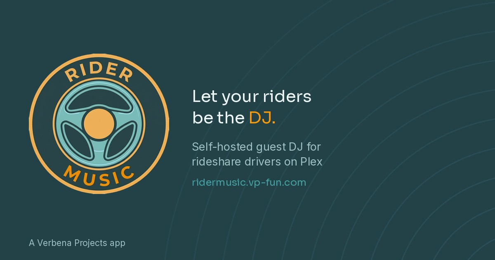

# RiderMusic

QR-based guest DJ system for rideshare passengers — from the makers of
[MusicMind for Plex](https://musicmind.vp-fun.com/).

A rideshare driver running Plex places a QR code in the car. Passengers
scan it, search the driver's music library, and queue songs — no app
install, no Plex account, no login. The driver's own phone plays the
music through the car stereo; the passenger's phone is just a remote.

**Status: early, working build.** The core loop (guest search/queue,
driver playback, admin session control) runs end to end and has been
tested on real hardware, including a working Docker image and a live
deployment behind Cloudflare Tunnel. Not yet tested in a real moving
car. Standalone product: does not require MusicMind to run.

## How it works

```
Guest phone (portal)  ->  RiderMusic backend  ->  Driver's phone (dashboard)  ->  car stereo
                              |
                              v
                        Plex Media Server
```

- **Guest portal:** search, browse mood buckets (genre-tag based —
  Chill, Dance, R&B, Disco, 80s, Country, Hip Hop, Classical,
  Electronic, Rock, Pop, Jazz, Reggae, Latin), add to queue,
  play/pause/skip, volume (clamped to a driver-set ceiling)
- **Rejoin codes:** the first passenger to scan joins instantly, no
  code needed. If a ride is already active, joining requires a
  4-digit code shown on the driver's dashboard — stops a stranger
  with an old link from attaching to a ride already in progress
- **Driver dashboard:** one page — now-playing audio player, session
  status, End Session button, and recent activity log all together.
  Streams audio directly from Plex, no Plexamp involved
- **In-app guide:** a `?` link on the dashboard explains QR setup,
  how sessions work, and where config lives
- **Printable sign:** the guide links to a QR sign generator
  (`/admin/sign`) — a print-ready card with a live QR code pointing
  at your own instance, generated server-side, no external tools
- **Sessions:** passive by default — first scan starts a session,
  it auto-expires, driver only needs to act to end one early

## Requirements

- A Plex Media Server with a music library
- A way to expose the backend to the internet — both the driver's
  phone and guest phones need to reach it from outside your home
  network while on the road. See "Exposing it to the internet" below.
- Docker (recommended), or Python 3.12+ for a manual install

## Setup

### Docker (recommended)

```bash
git clone https://github.com/earthmonkey419/ridermusic.git
cd ridermusic

cp config.example.py config.py
# edit config.py: PLEX_URL, PLEX_TOKEN, MUSIC_LIB, ADMIN_PASSWORD
# set COOKIE_SECURE = True (requires HTTPS — see below)

docker build -t ridermusic .
docker run -d --name ridermusic \
  -p 6869:6869 \
  -v $(pwd)/config.py:/app/config.py:ro \
  ridermusic
```

`config.py` holds your Plex token and admin password — it's bind-mounted
at container start, never baked into the image, so it never ends up in
a Docker layer or gets pushed anywhere by accident.

### Manual (Python)

```bash
git clone https://github.com/earthmonkey419/ridermusic.git
cd ridermusic
python3.12 -m venv .venv
source .venv/bin/activate
pip install -r requirements.txt

cp config.example.py config.py
# edit config.py as above

python init_db.py
python app.py
```

App runs on port `6869` by default.

**Before real use:** `COOKIE_SECURE` must be `True`, which requires
the app to be served over HTTPS. `False` is for local development
only — cookies won't persist in a real browser over plain HTTP.

**Getting a real Plex token:** see
[Plex's own guide](https://support.plex.tv/articles/204059436-finding-an-authentication-token-x-plex-token/).

## Exposing it to the internet

RiderMusic needs to be reachable from outside your home network —
both the driver's phone and guest phones are typically on cellular,
not your home WiFi, while actually driving.

**Cloudflare Tunnel is the tested, recommended path.** Broad steps,
assuming you already have a domain on Cloudflare:

1. In the Cloudflare Zero Trust dashboard, create a tunnel (or reuse
   an existing one if you're already running other services through
   Cloudflare)
2. Add a **Public Hostname** — pick a subdomain (e.g.
   `ridermusic.yourdomain.com`), and set the **Service URL** to
   `http://localhost:6869` (or whatever host/port RiderMusic is
   actually running on)
3. **Leave the Path field completely empty.** This one matters: if
   you set Path to something like `/admin/login` (easy mistake if
   you're testing one page first and forget to widen it), only that
   exact path gets routed through — every other page (`/guest`,
   `/join`, `/admin/dashboard`, static assets, everything) will 404
   even though the app itself is working fine. An empty Path routes
   the whole domain through.
4. Set `COOKIE_SECURE = True` in `config.py` and restart the app —
   Cloudflare terminates HTTPS at its edge, so cookies marked
   `Secure` will work correctly once traffic is actually coming
   through the tunnel's HTTPS endpoint.

**Any other reverse proxy that terminates HTTPS** (nginx, Caddy,
another tunnel provider) should work the same way in principle —
point it at `localhost:6869`, make sure it's not restricting which
paths get through, and set `COOKIE_SECURE = True` once it's serving
over real HTTPS.

## Using it

1. Expose the app to the internet per above
2. Print a QR code for the car — either use `/admin/sign` once
   logged in (generates one automatically for your own domain), or
   print a QR code pointing at `https://your-domain/join` yourself
3. As the driver: log in at `/admin/login`, then stay on
   `/admin/dashboard` — that's both your session control panel and
   the audio player, pair it to your car stereo (Bluetooth or aux)
4. Tap the `?` on the dashboard anytime for a quick in-app guide
5. Use **End Session** on the dashboard to cut a ride short if needed

## Known limitations (current)

- **Search quality** depends on what's actually tagged in your Plex
  library. RiderMusic layers literal artist/title/genre matches on top
  of Plex's fuzzy hub search, and mood buckets match real genre tags —
  but a library with thin or missing genre data will get thin results,
  same as any search built on top of it.
- **Single shared admin password** — no per-user accounts.
- **Driver dashboard reliability while backgrounded** (phone running
  CarPlay, screen off, etc.) hasn't been tested in a real moving car yet.
- **A song added right after an app restart sometimes doesn't
  auto-play** — suspected browser autoplay-policy interaction, not
  yet root-caused.
- **Installer/packaging story** for a driver who isn't the original
  developer is still minimal — this README is the current documentation.

## License

MIT — see [LICENSE](LICENSE).
